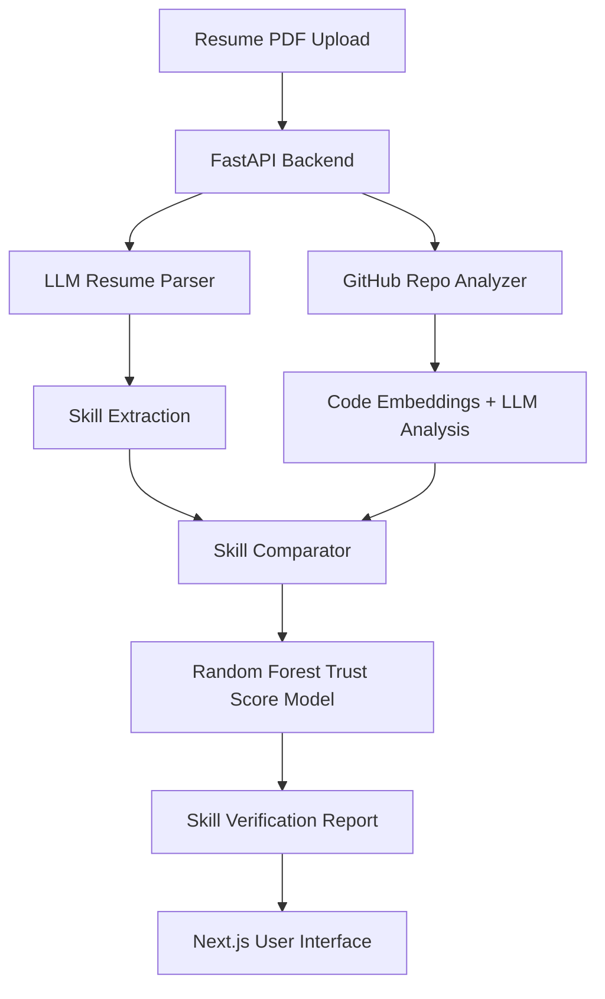
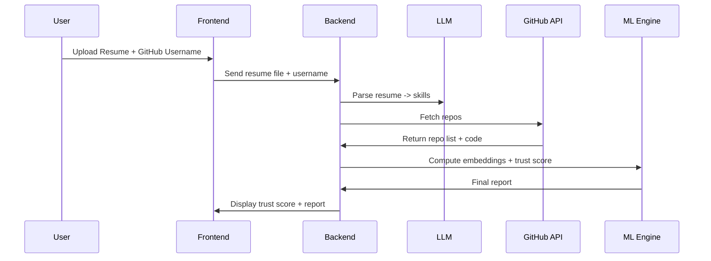

# 🚀 AI Resume Skill Verifier  
### **By Smit Mahajan**  
### URL: https://github.com/smitmahajan210

## 🌟 Overview
An end-to-end AI-powered platform that analyzes a candidate’s resume, extracts claimed skills, scans real GitHub repositories, and verifies whether those skills are genuinely demonstrated in their code.

This project solves a real recruiting challenge — **resume skill inflation** — using LLMs, embeddings, ML models, and full‑stack cloud engineering.

---

# 🖼️ GitHub Banner  


---

# 🏆 Badges  


---

# ✨ Features
- 🔍 AI Resume Parsing (LLMs)
- 🧠 Code Intelligence Engine (LLM + Static Code Analysis)
- 📊 ML Trust Score Model
- 🌐 Full Stack Web App (Next.js + FastAPI)
- 🗃 PostgreSQL Database
- 🐳 Full Docker Support
- ☁️ AWS Deployable

---

# 🏗️ Architecture Diagram



---

# ⚙️ System Flow Diagram



---

# 💻 Tech Stack
### **Frontend**
- Next.js, React, TypeScript, TailwindCSS  

### **Backend**
- FastAPI, Python, LangChain, PyMuPDF  

### **AI/ML**
- SentenceTransformers  
- Random Forest Classifier  
- OpenAI / Groq / Llama 3  

### **Database**
- PostgreSQL (SQLAlchemy ORM)

### **DevOps**
- Docker, Docker Compose  
- AWS S3, ECR, ECS Optional Deployment  

---

# 🚀 How to Run Locally

```bash
docker-compose up --build
```

Services:
| Service | URL |
|--------|-----|
| Frontend | http://localhost:3000 |
| Backend | http://localhost:8000 |
| Docs | http://localhost:8000/docs |

---

# 📦 Project Structure

```
resume-skill-verifier/
│── backend/
│── frontend/
│── docker-compose.yml
│── README.md
```

---

# 🤖 ML Explanation (For Interviews)
The ML engine compares **claimed skills** vs **verified GitHub skills**.

### Features Used:
- LLM skill extraction  
- Code embeddings  
- Repo complexity metrics  
- Library detection  

### Model:
- Random Forest Classifier → Trust Score (0–100)

### Interview Pitch:
“I built an ML pipeline that cross-verifies resume skills with real GitHub code using LLMs, embeddings, and a Random Forest model.”

---

# 📑 API Endpoints
| Method | Endpoint | Description |
|--------|----------|-------------|
| POST | `/upload_resume` | Extracts data from resume |
| GET | `/github/{username}` | Fetches repos |
| POST | `/verify` | Runs ML trust score |
| GET | `/report/{id}` | Returns final report |

---

# 🖼️ Screenshot Placeholders
Add your own screenshots in `/screenshots`:

```
screenshots/
  ui-dashboard.png
  resume-upload.png
  verification-report.png
  trust-score.png
```

---

# 👨‍💻 Author  
**Smit Mahajan**  
MS in CSE @ University at Buffalo  
GitHub: https://github.com/smitmahajan210  
LinkedIn: https://www.linkedin.com/in/smitmahajan/
